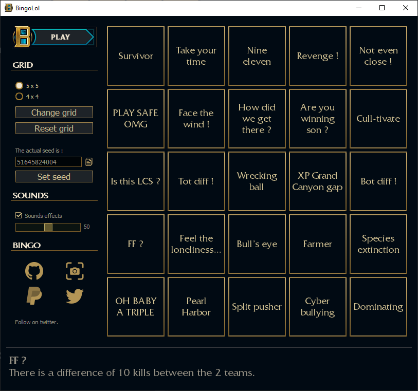

# BingoLol

## Description

Hey ! Have you ever played to a League of Legends bingo and though : "Yeh this is fun but it would be way cooler if the missions validates by themselves" 
No ? Ho... Really ? 
Well anyway because this dream has now become a reality with BingoLol ! 

**Featuring :**
* Ramdomly generated grids
* A total of 57 uniques missions !
* A nice UI (i hope so)
* Sounds effects
* A seed fonctionnality to share your grid to yours friends
* The possiblity to share a screenshot of your finished grid easely

## How to play ?
Download the .exe from [here](https://github.com/TrOllOchamO/BingoLol/releases/download/latest/BingoLol.zip), or from [our website](https://vad3l.github.io/BingoLeagueofLegends.github.io/), unzip it, run it, press the play button, and ggwp you are good to go !  

## How do i help the project ?
#### You can :
* Share the project to your friends
* Leave an heart-warming star on this project
* [Propose new missions](https://github.com/TrOllOchamO/BingoLolMissions/blob/main/MissionsChart.md) ideas on our [Twitter](https://twitter.com/BingoLolOff?t=13NYAyNQcbNKwDJpfPyWow&s=09)
* Report bugs [here](https://github.com/TrOllOchamO/BingoLol/issues) or on our [Twitter](https://twitter.com/BingoLolOff?t=13NYAyNQcbNKwDJpfPyWow&s=09)
* Directly participate to the project by submitting ideas or helping on [the to do list](https://github.com/TrOllOchamO/BingoLol/blob/main/ToDoList.md)
* Donate on [Paypal](https://paypal.me/TrOllOchamO?locale.x=fr_FR)

## Thanks
Special thanks to [the people who helped on the project](https://github.com/TrOllOchamO/BingoLol/blob/main/Thanks.md)

